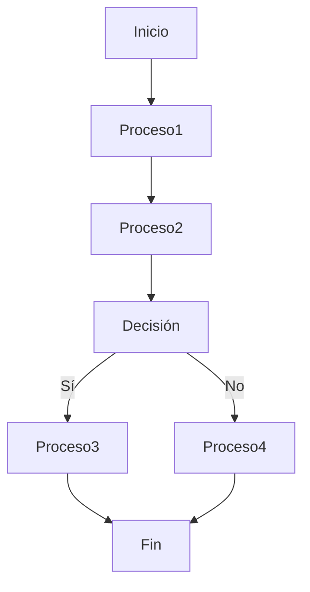
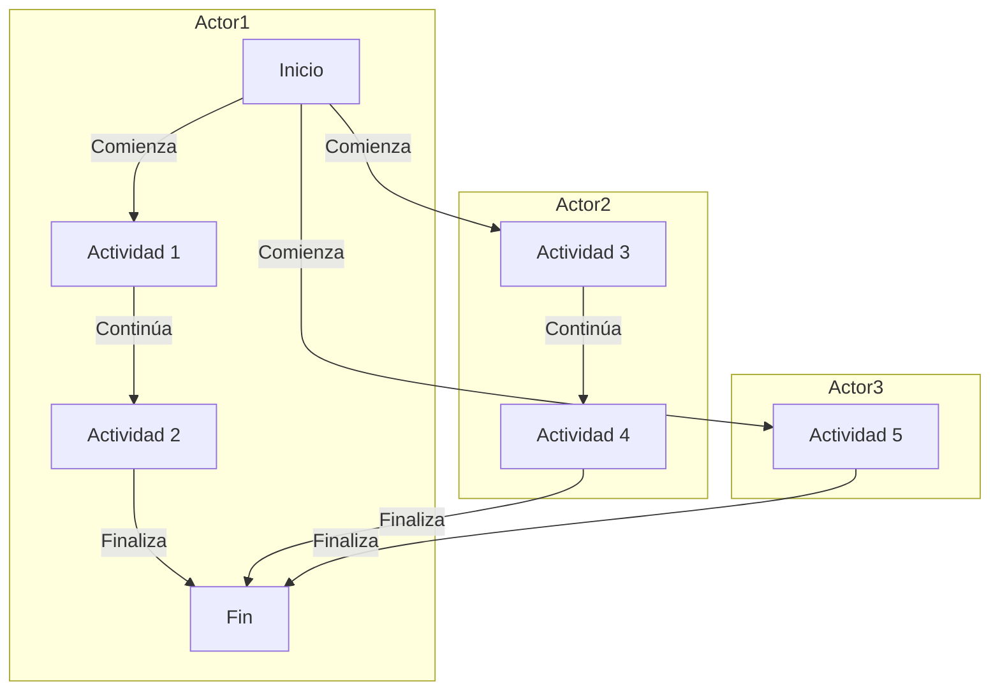

# ets
Repositorio dedicado a la asignatura de ETS

## Unidades
- [Unidad 1](unidad-1)

```mermaid
graph TD;
    Inicio --> Proceso1;
    Proceso1 --> Proceso2;
    Proceso2 --> Decisión;
    Decisión -- Sí --> Proceso3;
    Decisión -- No --> Proceso4;
    Proceso3 --> Fin;
    Proceso4 --> Fin;
```

```mermaid
graph TD;
    A[Inicio];
    B[Actividad 1];
    C[Actividad 2];
    D[Actividad 3];
    E[Actividad 4];
    F[Actividad 5];
    G[Fin];

    subgraph Actor1
        A -->|Comienza| B;
        B -->|Continúa| C;
        C -->|Finaliza| G;
    end

    subgraph Actor2
        A -->|Comienza| D;
        D -->|Continúa| E;
        E -->|Finaliza| G;
    end

    subgraph Actor3
        A -->|Comienza| F;
        F -->|Finaliza| G;
    end
```