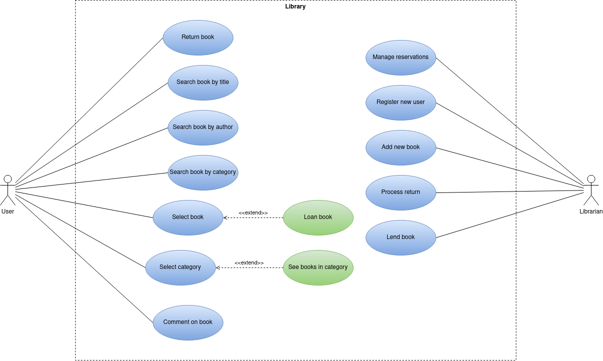

# Use Case Diagram and specifications for library

## Index
- [Actors](#index01)
- [Use Cases](#index02)
- [Diagram](#index03)
- [Actor Specifications](#index04)
    - [User](#actor1spec)
    - [Librarian](#actor2spec)
- [Use Case Specifications](#index05)
    - [UC1](#uc01)
    - [UC2](#uc02)
    - [UC3](#uc03)
    - [UC4](#uc04)
    - [UC5](#uc05)
    - [UC6](#uc06)
    - [UC7](#uc07)
    - [UC8](#uc08)
    - [UC9](#uc09)
    - [UC10](#uc10)
    - [UC11](#uc11)
    - [UC12](#uc12)
    - [UC13](#uc13)
    - [UC14](#uc14)

## Actors 
- User
- Librarian
## Use Cases 

- User:
    - UC1: Return book
    - UC2: Search book by title
    - UC3: Search book by author
    - UC4: Search book by category
    - UC5: Select book
    - UC6: Loan book
    - UC7: Select category
    - UC8: See books in category
    - UC9: Comment on book
- Librarian:
    - UC10: Manage reservations
    - UC11: Register new user
    - UC12: Add new book
    - UC13: Process return
    - UC14: Lend book

## Diagram 

## Actor Specifications 

| Actor | User |
|---|---|
| Description  | User of library |
| Characteristics  |  |
| Relations | None |
| References | UC1 UC2 UC3 UC4 UC5 UC6 UC7 UC8 UC9 |
|  Notes |  |
| Author  | José Maximiliano Boada Martín |
| Date | 20/12/2023 |

|  Attribute |||
|---|---|---|
| _Name_  | _Description_  | _Type_ |
| name | Name of user | String
| id | ID of user | String
| loanHistory | Name of user | List\<Loan>

| Actor | Librarian |
|---|---|
| Description  | Librarian of library |
| Characteristics  |  |
| Relations | None |
| References | UC10 UC11 UC12 UC13 UC14 |
|  Notes | |
| Author  | José Maximiliano Boada Martín |
| Date | 20/12/2023 |

|  Attribute |||
|---|---|---|
| _Name_  | _Description_  | _Type_ |
| name | Name of librarian | String
| employeeNumber | ID of librarian | int
| weeklyHours | Hours worked in a week | int

## Use Case Specifications 

| Use Case 1 | Return Book | 
|---|---|
| Source  | https://github.com/jpexposito/docencia/tree/master/Primero/ETS/PROYECTO  |
| Actor  | User |
| Description | User returns book |
| Basic flow |  |
| Pre-conditions |  |  
| Post-conditions  |  |  
|  Requirements |  |
|  Notes |  |
| Author  | José Maximiliano Boada Martín |
| Date | 16/01/2024 |

| Use Case 2 | Search book by title | 
|---|---|
| Source  | https://github.com/jpexposito/docencia/tree/master/Primero/ETS/PROYECTO  |
| Actor  | User |
| Description | User searches book by title |
| Basic flow |  |
| Pre-conditions |  |  
| Post-conditions  |  |  
|  Requirements |  |
|  Notes |  |
| Author  | José Maximiliano Boada Martín |
| Date | 16/01/2024 |

| Use Case 3 | Search book by author | 
|---|---|
| Source  | https://github.com/jpexposito/docencia/tree/master/Primero/ETS/PROYECTO  |
| Actor  | User |
| Description | User searches book by author |
| Basic flow |  |
| Pre-conditions |  |  
| Post-conditions  |  |  
|  Requirements |  |
|  Notes |  |
| Author  | José Maximiliano Boada Martín |
| Date | 16/01/2024 |

| Use Case 4 | Search book by category | 
|---|---|
| Source  | https://github.com/jpexposito/docencia/tree/master/Primero/ETS/PROYECTO  |
| Actor  | User |
| Description | User searches book by category |
| Basic flow |  |
| Pre-conditions |  |  
| Post-conditions  |  |  
|  Requirements |  |
|  Notes |  |
| Author  | José Maximiliano Boada Martín |
| Date | 16/01/2024 |

| Use Case 5 | Select book | 
|---|---|
| Source  | https://github.com/jpexposito/docencia/tree/master/Primero/ETS/PROYECTO  |
| Actor  | User |
| Description | User selects a book to loan |
| Basic flow | UC5 -> UC6 |
| Pre-conditions |  |  
| Post-conditions  |  |  
|  Requirements |  |
|  Notes |  |
| Author  | José Maximiliano Boada Martín |
| Date | 16/01/2024 |

| Use Case 6 | Loan book | 
|---|---|
| Source  | https://github.com/jpexposito/docencia/tree/master/Primero/ETS/PROYECTO  |
| Actor  | User |
| Description | User loans book |
| Basic flow | UC5 -> UC6  |
| Pre-conditions |  |  
| Post-conditions  |  |  
|  Requirements | UC5 |
|  Notes |  |
| Author  | José Maximiliano Boada Martín |
| Date | 16/01/2024 |

| Use Case 7 | Select category | 
|---|---|
| Source  | https://github.com/jpexposito/docencia/tree/master/Primero/ETS/PROYECTO  |
| Actor  | User |
| Description | User selects a category |
| Basic flow | UC7 -> UC8 |
| Pre-conditions |  |  
| Post-conditions  |  |  
|  Requirements |  |
|  Notes |  |
| Author  | José Maximiliano Boada Martín |
| Date | 16/01/2024 |

| Use Case 8 | See books in category | 
|---|---|
| Source  | https://github.com/jpexposito/docencia/tree/master/Primero/ETS/PROYECTO  |
| Actor  | User |
| Description | User sees books in category |
| Basic flow | UC7 -> UC8 |
| Pre-conditions |  |  
| Post-conditions  |  |  
|  Requirements | UC7 |
|  Notes |  |
| Author  | José Maximiliano Boada Martín |
| Date | 16/01/2024 |

| Use Case 9 | Comment on book | 
|---|---|
| Source  | https://github.com/jpexposito/docencia/tree/master/Primero/ETS/PROYECTO  |
| Actor  | User |
| Description | User comments on book |
| Basic flow |  |
| Pre-conditions |  |  
| Post-conditions  |  |  
|  Requirements |  |
|  Notes |  |
| Author  | José Maximiliano Boada Martín |
| Date | 16/01/2024 |

| Use Case 10 | Manage reservations | 
|---|---|
| Source  | https://github.com/jpexposito/docencia/tree/master/Primero/ETS/PROYECTO  |
| Actor  | Librarian |
| Description | Librarian manages reservations made by user |
| Basic flow |  |
| Pre-conditions |  |  
| Post-conditions  |  |  
|  Requirements |  |
|  Notes |  |
| Author  | José Maximiliano Boada Martín |
| Date | 16/01/2024 |

| Use Case 11 | Register new user | 
|---|---|
| Source  | https://github.com/jpexposito/docencia/tree/master/Primero/ETS/PROYECTO  |
| Actor  | Librarian |
| Description | Librarian registers a new user into the system |
| Basic flow |  |
| Pre-conditions |  |  
| Post-conditions  |  |  
|  Requirements |  |
|  Notes |  |
| Author  | José Maximiliano Boada Martín |
| Date | 16/01/2024 |

| Use Case 12 | Add new book | 
|---|---|
| Source  | https://github.com/jpexposito/docencia/tree/master/Primero/ETS/PROYECTO  |
| Actor  | Librarian |
| Description | Librarian adds new book to library |
| Basic flow |  |
| Pre-conditions |  |  
| Post-conditions  |  |  
|  Requirements |  |
|  Notes |  |
| Author  | José Maximiliano Boada Martín |
| Date | 16/01/2024 |

| Use Case 13 | Process return | 
|---|---|
| Source  | https://github.com/jpexposito/docencia/tree/master/Primero/ETS/PROYECTO  |
| Actor  | Librarian |
| Description | Librarian processes book return |
| Basic flow |  |
| Pre-conditions |  |  
| Post-conditions  |  |  
|  Requirements |  |
|  Notes |  |
| Author  | José Maximiliano Boada Martín |
| Date | 16/01/2024 |

| Use Case 14 | Lend book | 
|---|---|
| Source  | https://github.com/jpexposito/docencia/tree/master/Primero/ETS/PROYECTO  |
| Actor  | Librarian |
| Description | Librarian facilitates book loan for user |
| Basic flow |  |
| Pre-conditions |  |  
| Post-conditions  |  |  
|  Requirements |  |
|  Notes |  |
| Author  | José Maximiliano Boada Martín |
| Date | 16/01/2024 |

