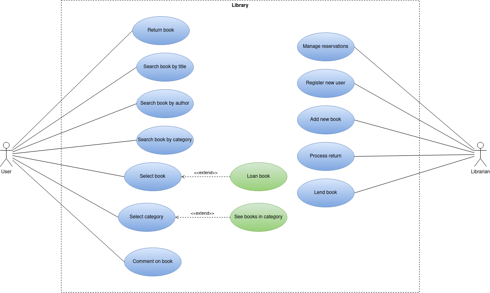

# Use Case Diagram and specifications

## Actors

## Use Cases

## Diagram

## Specs Actors

| Actor | User |
|---|---|
| Description  | User of library |
| Characteristics  |  |
| Relations |  |
| References | _TBD_ |
|  Notes |  |
| Author  | José Maximiliano Boada Martín |
| Date | 20/12/2023 |

|  Attribute |||
|---|---|---|
| _Name_  | _Description_  | _Type_ |
| name | Name of user | String
| id | ID of user | String
| loanHistory | Name of user | List\<Loan>

| Actor | Librarian |
|---|---|
| Description  | Librarian of library |
| Characteristics  |  |
| Relations |  |
| References | _TBD_ |
|  Notes |  |
| Author  | José Maximiliano Boada Martín |
| Date | 20/12/2023 |

|  Attribute |||
|---|---|---|
| _Name_  | _Description_  | _Type_ |
| | |

## Specs Use Cases

| Use Case | XXX |
|---|---|
| Source  | https://github.com/jpexposito/docencia/tree/master/Primero/ETS/PROYECTO  |
| Actor  |  |
| Description |  |
| Basic flow |  |
| Pre-conditions |  |  
| Post-conditions  |  |  
|  Requirements |  |
|  Notes |  |
| Author  | José Maximiliano Boada Martín |
| Date |  |

