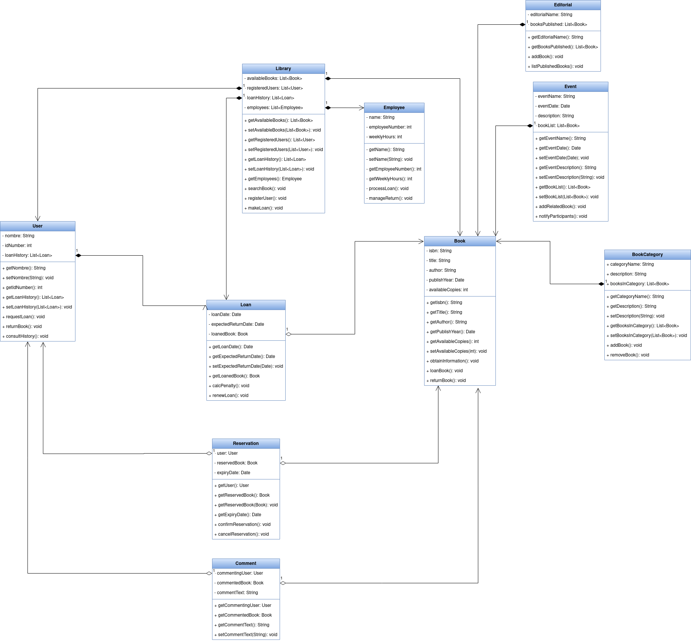

<div align="justify">

# Class Diagram and pseudocode

## Index
- [Classes](#index01)
- [Diagram](#index02)
- [Diagram](#index03)

## Classes <a name="index01"></a>

Click on any of the classes to view their pseudocode.

- [Book](#class01)
- [User](#class02)
- [Loan](#class03)
- [Library](#class04)
- [Employee](#class05)
- [BookCategory](#class06)
- [Reservation](#class07)
- [Editorial](#class08)
- [Event](#class09)
- [Comment](#class10)

## Diagram <a name="index02"></a>

</img>

## Pseudocode <a name="index01"></a>

### Book <a name="class01"></a>

```java
public class Book {
    private String isbn
    private String title
    private String author
    private Date publishYear
    private int availableCopies

    Constructors go here

    Getters and setters go here

    public void obtainInformation()
    public void loanBook()
    public void returnBook()
}
```

### User <a name="class02"></a>

```java
public class User {
    private String name
    private int idNumber
    private List<Loan> loanHistory

    Constructors go here

    Getters and setters go here

    public void requestLoan()
    public void returnBook()
    public void consultHistory()
}
```

### Loan <a name="class03"></a>

```java
public class Loan {
    private Date loanDate
    private Date expectedReturnDate
    private Book loanedBook

    Constructors go here

    Getters and setters go here

    public void calcPenalty()
    public void renewLoan()
}
```

### Library <a name="class04"></a>

```java
public class Library {
    private List<Book> availableBooks
    private List<User> registeredUsers
    private List<Loan> loanHistory
    private List<Employee> employees

    Constructors go here

    Getters and setters go here

    public void searchBook()
    public void registerUser()
    public void makeLoan()
}
```

### Employee <a name="class05"></a>

```java
public class Employee {
    private String name
    private int employeeNumber
    private int weeklyHours

    Constructors go here

    Getters and setters go here

    public void processLoan()
    public void manageReturn()
}
```

### BookCategory <a name="class06"></a>

```java
public class BookCategory {
    private String categoryName
    private String description
    private List<Book> booksInCategory

    Constructors go here

    Getters and setters go here

    public void addBook()
    public void removeBook()
}
```

### Reservation <a name="class07"></a>

```java
public class Reservation {
    private User user
    private Book reservedBook
    private Date expiryDate

    Constructors go here

    Getters and setters go here

    public void confirmReservation()
    public void cancelReservation()
}
```

### Editorial <a name="class08"></a>

```java
public class Editorial {
    private String name
    private List<Book> booksPublished

    Constructors go here

    Getters and setters go here

    public void listPublishedBooks()
}
```

### Event <a name="class09"></a>

```java
public class Event {
    private String eventName
    private Date eventDate
    private String description
    private List<Book> bookList

    Constructors go here

    Getters and setters go here

    public void addRelatedBook()
    public void notifyParticipants()
}
```

### Comment <a name="class10"></a>

```java
public class Comment {
    private User commentingUser
    private Book commentedBook
    private String commentText

    Constructors go here

    Getters and setters go here
}
```

</div>