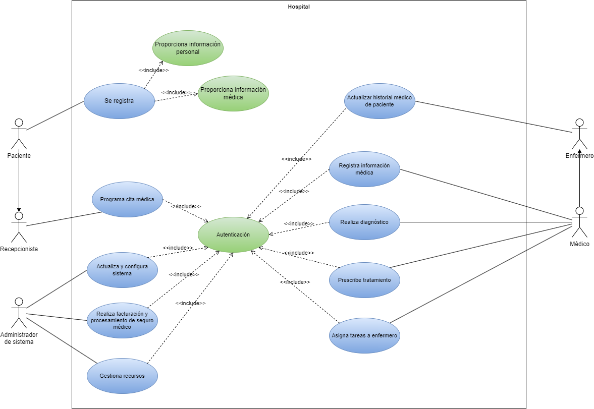

# Sistema de gestión hospitalaria

El sistema de gestión hospitalaria tiene como objetivo mejorar la eficiencia y coordinación de los procesos dentro de un hospital. 
En el sistema participan distantas personas, como son: Paciente, Médico, Enfermero, Administrador del Sistema y Recepcionista. A continuación, se presentan algunos casos de uso para este sistema:

La información que se posee de cada uno de ellos es la siguiente:
- Paciente: Un individuo que busca servicios médicos en el hospital.
- Médico: Profesional médico encargado de diagnosticar y tratar a los pacientes.
- Enfermero: Encargado de asistir a los médicos y cuidar a los pacientes.
- Administrador del Sistema: Responsable de la configuración y administración del sistema.
- Recepcionista: Encargado de la recepción de pacientes y asignación de citas.

Las acciones que se realizarán en el sistema son las que siguen:
- El paciente se registra en el sistema proporcionando información personal y médica.
- El paciente o la recepcionista programa citas médicas para los pacientes. (Debe autenticado)
- El médico realiza diagnósticos, prescribe tratamientos y registra la información médica del paciente.(Debe autenticado)
- El médico y el enfermero pueden acceder y actualizar el historial médico del paciente.(Debe autenticado)
- El médico asigna tareas específicas a los enfermeros relacionadas con la atención del paciente.(Debe autenticado)
- El administrador del sistema realiza configuraciones y actualizaciones del sistema.(Debe autenticado)
- El personal administrativo realiza tareas relacionadas con la facturación y el procesamiento del seguro médico.(Debe autenticado)
- El administrador del sistema gestiona los recursos hospitalarios, como camas, equipos médicos y suministros.(Debe autenticado)

Como podemos observar, el sistema tiene distintos actores, casos de uso y relaciones entre ellos. Se pide realizar el diagrama de casos de uso, identificando: los actores, casos de uso y realizando la especificación.

## Índice 

- [Diagrama de casos de uso](#index01)
- [Especificación](#index02)
    - [Actores](#index02-01)
    - [Casos de uso](#index02-02)

## Diagrama de casos de uso 

</img>

## Especificación 

### Actores 

|  Actor | Paciente |
|---|---|
| Descripción  | Paciente de hospital  |
| Características  |  |
| Relaciones | Recepcionista  |
| Referencias | Se registra, programa cita médica |   
|  Notas |   |
| Autor  | Maxi |
|Fecha | 18/11/2023 |

|  Actor | Recepcionista |
|---|---|
| Descripción  | Recepcionista de hospital  |
| Características  |  |
| Relaciones | Paciente  |
| Referencias | Programa cita médica |   
|  Notas |   |
| Autor  | Maxi |
|Fecha | 18/11/2023 |

|  Actor | Médico |
|---|---|
| Descripción  | Médico de hospital  |
| Características  |  |
| Relaciones | Enfermero  |
| Referencias | Registra información médica, realiza diagnóstico, prescribe tratamiento, asigna tareas a enfermero, actualiza historial médico de paciente |   
|  Notas |   |
| Autor  | Maxi |
|Fecha | 18/11/2023 |

|  Actor | Enfermero |
|---|---|
| Descripción  | Enfermero de hospital  |
| Características  |  |
| Relaciones | Médico  |
| Referencias | Actualiza historial médico de paciente |   
|  Notas |   |
| Autor  | Maxi |
|Fecha | 18/11/2023 |

|  Actor | Administrador de sistema |
|---|---|
| Descripción  | Administrador de sistema de hospital  |
| Características  |  |
| Relaciones |   |
| Referencias | Actualiza y configura el sistema, realiza facturarión y procesamiento de seguro médico, gestiona recursos |   
|  Notas |   |
| Autor  | Maxi |
|Fecha | 18/11/2023 |

### Casos de uso 

|  Caso de Uso	CU | Se registra  |
|---|---|
| Fuentes  | Sistema de hospital  |
| Actor  | Paciente |
| Descripción | El paciente se registra  |
| Flujo básico |  |
| Pre-condiciones |  |  
| Post-condiciones  |  |  
|  Requerimientos | Proporcionar información personal, proporcionar información médica |
|  Notas |   |
| Autor  | Maxi |
|Fecha | 18/11/2023 |

|  Caso de Uso	CU | Programa cita médica  |
|---|---|
| Fuentes  | Sistema de hospital  |
| Actor  | Recepcionista, paciente |
| Descripción | El paciente o el recepcionista pueden programar la cita médica  |
| Flujo básico |  |
| Pre-condiciones |  |  
| Post-condiciones  |  |  
|  Requerimientos | Autenticación |
|  Notas |   |
| Autor  | Maxi |
|Fecha | 18/11/2023 |

|  Caso de Uso	CU | Registra información médica  |
|---|---|
| Fuentes  | Sistema de hospital  |
| Actor  | Médico |
| Descripción | El médico registra la información médica del paciente  |
| Flujo básico |  |
| Pre-condiciones |  |  
| Post-condiciones  |  |  
|  Requerimientos | Autenticación |
|  Notas |   |
| Autor  | Maxi |
|Fecha | 18/11/2023 |

|  Caso de Uso	CU | Realiza diagnóstico |
|---|---|
| Fuentes  | Sistema de hospital  |
| Actor  | Médico |
| Descripción | El médico realiza el diagnóstico del paciente  |
| Flujo básico |  |
| Pre-condiciones |  |  
| Post-condiciones  |  |  
|  Requerimientos | Autenticación |
|  Notas |   |
| Autor  | Maxi |
|Fecha | 18/11/2023 |

|  Caso de Uso	CU | Prescribe tratamiento |
|---|---|
| Fuentes  | Sistema de hospital  |
| Actor  | Médico |
| Descripción | El médico prescribe el tratamiento para el paciente  |
| Flujo básico |  |
| Pre-condiciones |  |  
| Post-condiciones  |  |  
|  Requerimientos | Autenticación |
|  Notas |   |
| Autor  | Maxi |
|Fecha | 18/11/2023 |

|  Caso de Uso	CU | Actualizar historial médico del paciente |
|---|---|
| Fuentes  | Sistema de hospital  |
| Actor  | Médico, enfermero |
| Descripción | El médico o el enfermero actualizan el historial médico del paciente  |
| Flujo básico |  |
| Pre-condiciones |  |  
| Post-condiciones  |  |  
|  Requerimientos | Autenticación |
|  Notas |   |
| Autor  | Maxi |
|Fecha | 18/11/2023 |

|  Caso de Uso	CU | Actualiza y configura sistema |
|---|---|
| Fuentes  | Sistema de hospital  |
| Actor  | Administrador de sistema |
| Descripción | El administrador actualiza y configura el sistema  |
| Flujo básico |  |
| Pre-condiciones |  |  
| Post-condiciones  |  |  
|  Requerimientos | Autenticación |
|  Notas |   |
| Autor  | Maxi |
|Fecha | 18/11/2023 |

|  Caso de Uso	CU | Realiza facturación y procesamiento de seguro médico |
|---|---|
| Fuentes  | Sistema de hospital  |
| Actor  | Administrador de sistema |
| Descripción | El administrador realiza tareas de facturación y procesamiento del seguro médico  |
| Flujo básico |  |
| Pre-condiciones |  |  
| Post-condiciones  |  |  
|  Requerimientos | Autenticación |
|  Notas |   |
| Autor  | Maxi |
|Fecha | 18/11/2023 |

|  Caso de Uso	CU | Gestiona recursos |
|---|---|
| Fuentes  | Sistema de hospital  |
| Actor  | Administrador de sistema |
| Descripción | El administrador gestiona recursos del hospital  |
| Flujo básico |  |
| Pre-condiciones |  |  
| Post-condiciones  |  |  
|  Requerimientos | Autenticación |
|  Notas |   |
| Autor  | Maxi |
|Fecha | 18/11/2023 |

