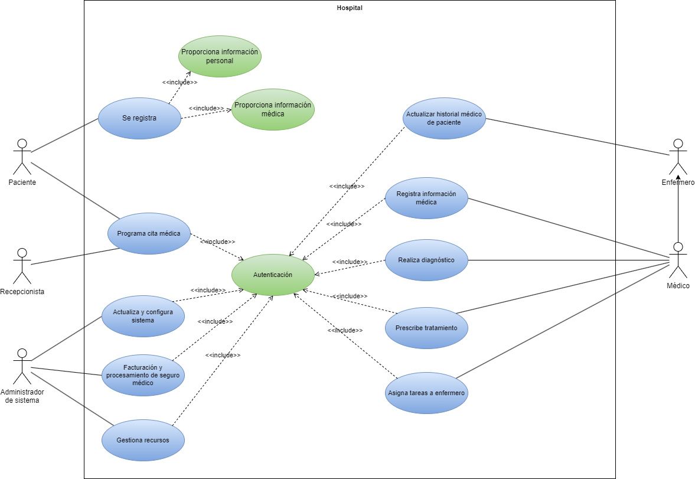

# Sistema de gestión hospitalaria

El sistema de gestión hospitalaria tiene como objetivo mejorar la eficiencia y coordinación de los procesos dentro de un hospital. 
En el sistema participan distantas personas, como son: Paciente, Médico, Enfermero, Administrador del Sistema y Recepcionista. A continuación, se presentan algunos casos de uso para este sistema:

La información que se posee de cada uno de ellos es la siguiente:
- Paciente: Un individuo que busca servicios médicos en el hospital.
- Médico: Profesional médico encargado de diagnosticar y tratar a los pacientes.
- Enfermero: Encargado de asistir a los médicos y cuidar a los pacientes.
- Administrador del Sistema: Responsable de la configuración y administración del sistema.
- Recepcionista: Encargado de la recepción de pacientes y asignación de citas.

Las acciones que se realizarán en el sistema son las que siguen:
- El paciente se registra en el sistema proporcionando información personal y médica.
- El paciente o la recepcionista programa citas médicas para los pacientes. (Debe autenticado)
- El médico realiza diagnósticos, prescribe tratamientos y registra la información médica del paciente.(Debe autenticado)
- El médico y el enfermero pueden acceder y actualizar el historial médico del paciente.(Debe autenticado)
- El médico asigna tareas específicas a los enfermeros relacionadas con la atención del paciente.(Debe autenticado)
- El administrador del sistema realiza configuraciones y actualizaciones del sistema.(Debe autenticado)
- El personal administrativo realiza tareas relacionadas con la facturación y el procesamiento del seguro médico.(Debe autenticado)
- El administrador del sistema gestiona los recursos hospitalarios, como camas, equipos médicos y suministros.(Debe autenticado)

Como podemos observar, el sistema tiene distintos actores, casos de uso y relaciones entre ellos. Se pide realizar el diagrama de casos de uso, identificando: los actores, casos de uso y realizando la especificación.

## Índice 

- [Diagrama de casos de uso](#index01)
- [Especificación](#index02)
    - [Actores](#index02-01)
    - [Casos de uso](#index02-02)

## Diagrama de casos de uso 

</img>

